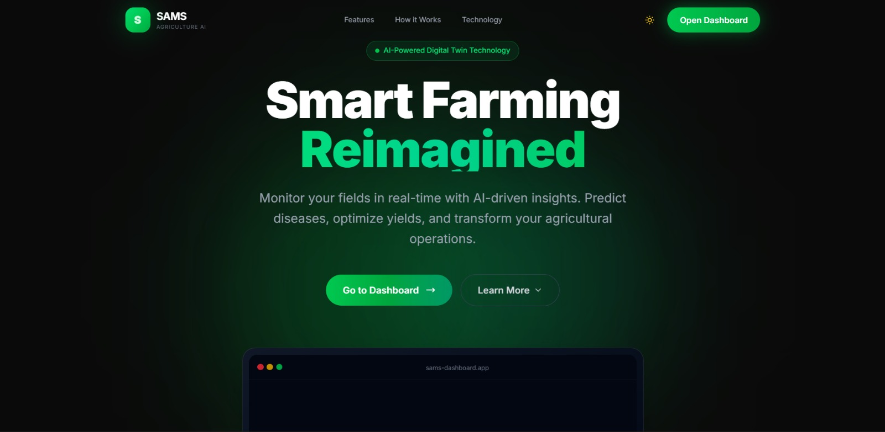
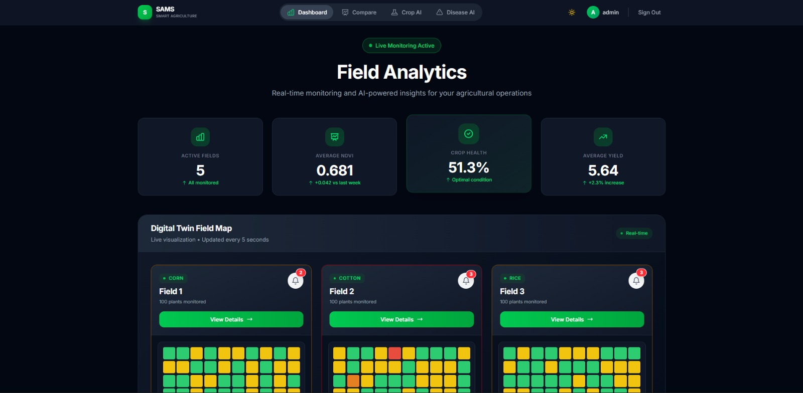
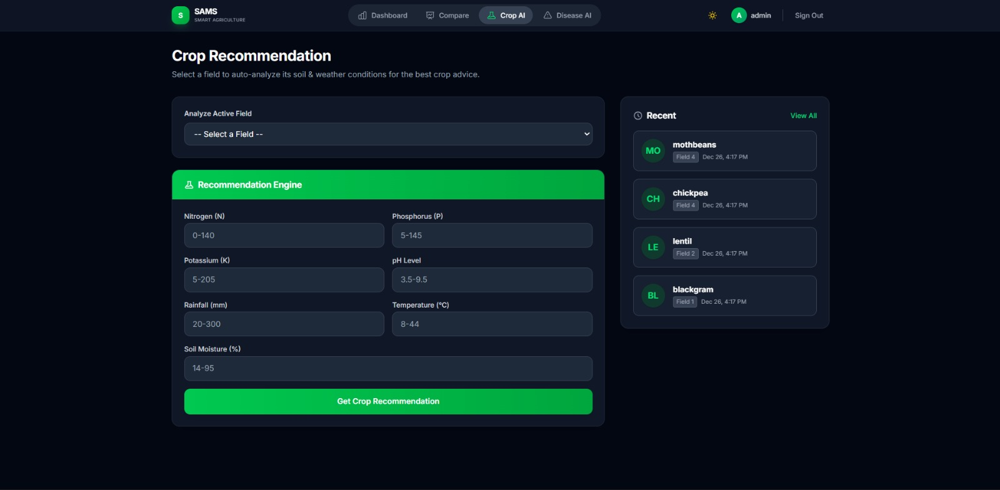
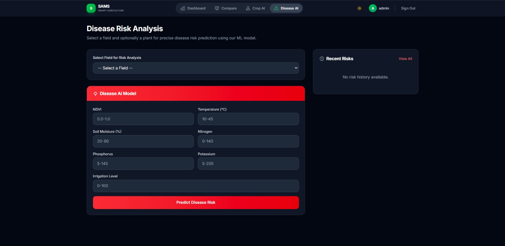
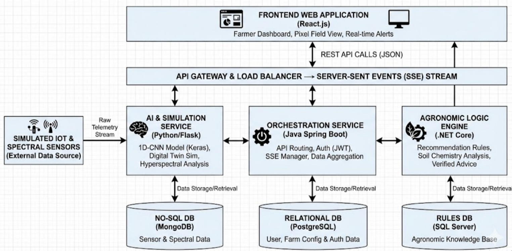
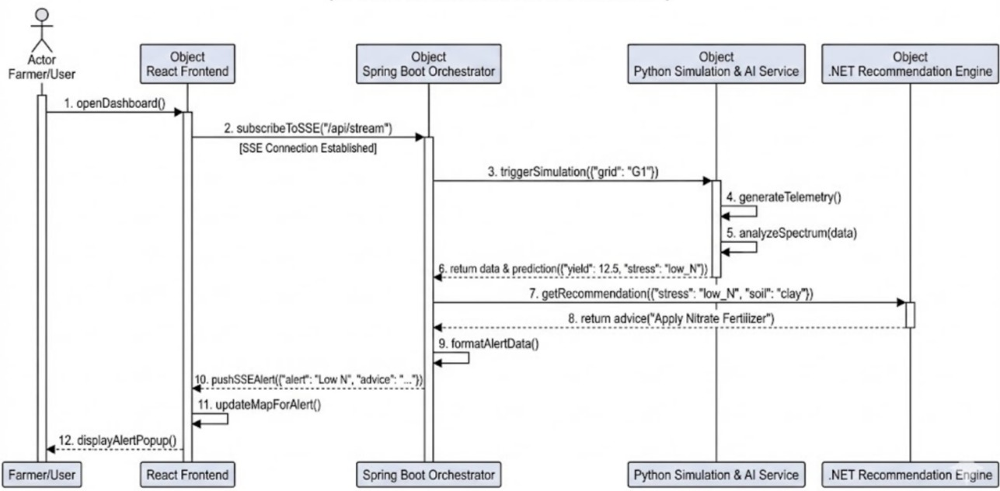
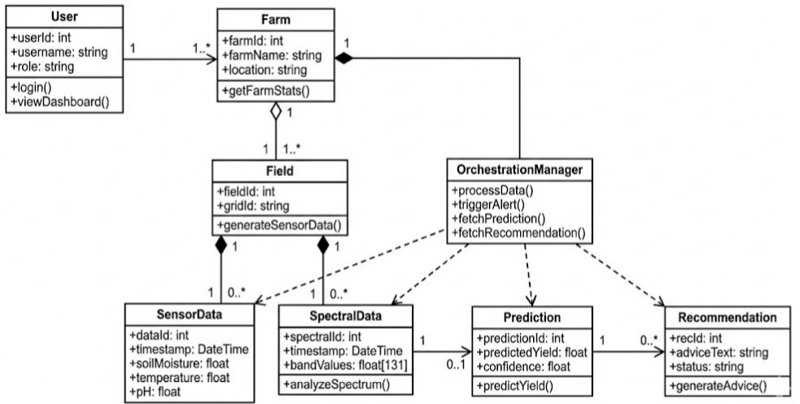
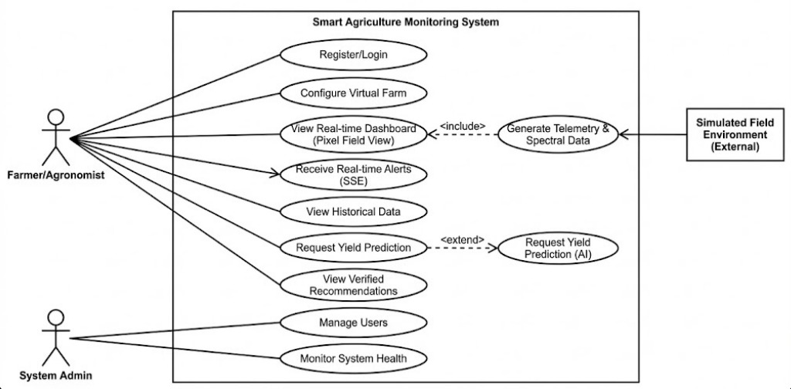
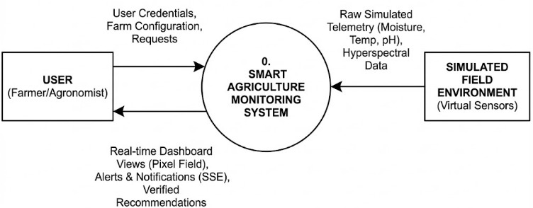
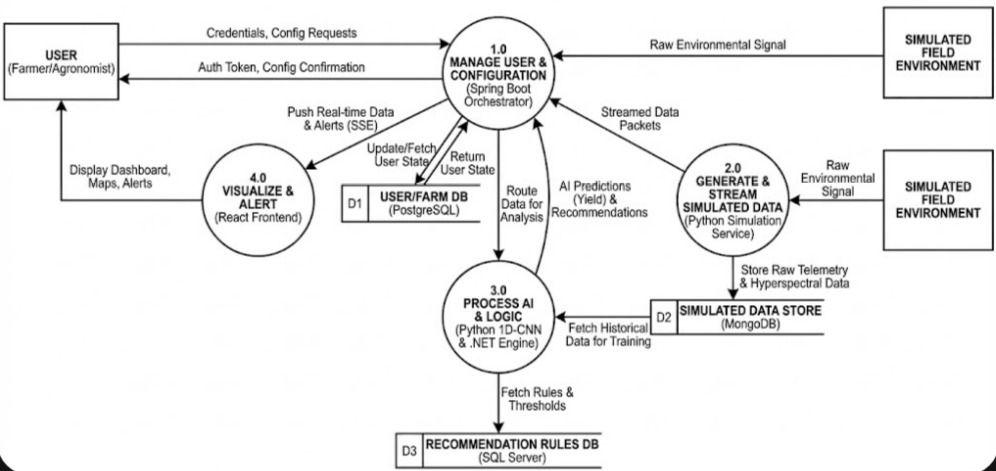

# Smart Agriculture Monitoring System

A powerful web-based platform for precision agriculture, combining real-time monitoring, AI-driven insights, and digital twin simulation. This tool empowers farmers and agronomists to make data-driven decisions for optimal crop health and yield.

## Features

### 🌾 Smart Field Monitoring
- Real-time tracking of critical soil parameters (Nitrogen, Phosphorus, Potassium, pH)
- Live environmental monitoring (Temperature, Humidity, Moisture)
- **NDVI Visualization**: Color-coded field health mapping (Healthy, Moderate, Critical)
- Interactive Grid-based Field View for granular management

### 🤖 Intelligent Recommendations
- **Crop Recommendation Engine**: ML-based suggestions for optimal crops based on soil and weather data
- **Disease Detection**: Image analysis for early identification of plant diseases
- **Smart Remediation**: Automated suggestions for correcting warnings (e.g., "Water Field", "Add Fertilizer")

### 📊 Advanced Analytics & Profiling
- Comprehensive farm health assessment
- Historical trend analysis for soil quality and crop growth
- Aggregated metrics for easy decision making (Avg NDVI, Yield Predictions)
- Interactive charts and visualizations for temporal data

### ⚠️ Real-time Alert System
- Instant notifications for critical threshold breaches (e.g., Low Moisture, Low Nitrogen)
- Server-Sent Events (SSE) for low-latency updates
- Severity processing (Critical, Warning, Information)
- Actionable alerts with one-click fix capabilities

### 🚜 Digital Twin Simulation
- **Dynamic Field Simulation**: Simulates changing field conditions over time
- **Interactive Control**: Adjust simulation speed and event frequency
- **Scenario Testing**: Test how fields react to different environmental changes

## 🏗️ System Architecture

## 📐 Design Diagrams
| Sequence Diagram | Class Diagram |
|:---:|:---:|
|  |  |

| Use Case Diagram | Data Flow (L0) |
|:---:|:---:|
|  |  |

| Data Flow (L1) | |
|:---:|:---:|
|  | |

## Tech Stack
- **Frontend**: React.js, Tailwind CSS, Recharts
- **Backend**: Spring Boot (Java), JPA/Hibernate
- **Machine Learning**: ML.NET (C#), Python (FastAPI)
- **Database**: MySQL / H2
- **Communication**: REST APIs, Server-Sent Events

This platform is designed to modernize farming practices by providing intuitive, actionable insights accessible to everyone from independent farmers to large-scale agricultural enterprises.